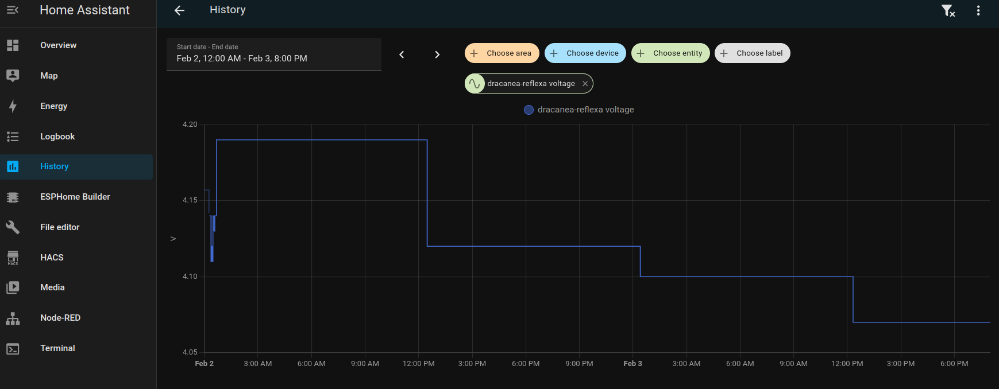
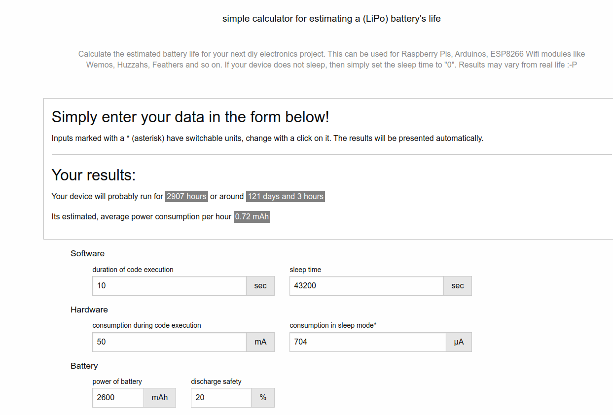

+++
date = '2025-02-03T22:42:08-08:00'
draft = false
title = 'Fixing deep sleep power usage'
+++

# The low-power board was burning the battery real fast

When I built the first prototype of the low-power LoRa board, I didn't expect much in terms of battery life because I used breakout boards and inexpensive components from AliExpress. After confirming that the circuit worked, I sent the PCB for manufacturing, using genuine parts sourced from LCSC and Mouser. However, the battery life I anticipated was far from my initial calculations.

The current was too high in deep sleep:

At first, I suspected the issue might be due to using cheap LiPo batteries, so I replaced them with original Sony 18650 purchased from a reputable supplier. To my surprise, the battery was discharging too quickly; it dropped from 100% to 86% in about 48 hours. Something wasn't right.

To investigate further, I used my Nordic Power Profiler Kit II to run some tests. I discovered that the board was consuming around 70 mA while in sleep mode, significantly more than my initial estimation of 100 microamperes.

While monitoring the V_AUX rail, I noticed it was at 3 volts during sleep mode.

Upon re-reading the XC6220 datasheet, I found a small note stating: "The voltage output of the Series A/B becomes unstable when the CE pin is left floating."

This prompted me to double-check the CE pin, which is connected to a GPIO on the ESP32. Under the oscilloscope, I found that the pin was consistently HIGH.

The [code](https://github.com/jescarri/lora-node/blob/b964c58d307a0410fe1cc0311fdbbc63e602e620/src/main.cpp#L57-L59) immediately sets the pin high at MCU boot and is supposed to set it to LOW before entering sleep mode. However, I [mistakenly reset the GPIO state](https://github.com/jescarri/lora-node/blob/98108ed68285c180558b520b54b7e0e91f35ea60/src/main.cpp#L171) before deep sleep and forgot to use the RTC to maintain the GPIO state while sleeping.

After making a [quick fix](https://github.com/jescarri/lora-node/pull/1), I observed that the power consumption during deep sleep was around 700 microamperes.

According to the [IoT battery life calculator](https://www.of-things.de/battery-life-calculator.php), my device should now run for approximately 100 days.

